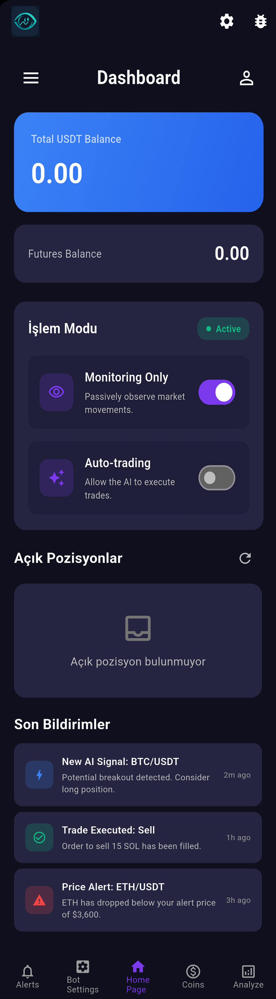
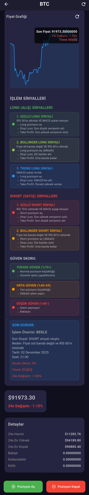

# CryptoVision Analyzer - AI Destekli Kripto Analiz Platformu

## ⚠️ Önemli Not
Bu repository sadece portföy ve vitrin amaçlıdır. Kaynak kodlar ticari nedenlerle paylaşılmamaktadır. Bu sayfa, uygulama ekran görüntüleri ve genel bilgiler için oluşturulmuştur.

Tüm hakları saklıdır. © 2024 Davut Can

## 🎯 Proje Hakkında
CryptoVision Analyzer, kripto para ticareti için geliştirilmiş AI destekli teknik analiz ve otomatik işlem platformudur. OpenAI GPT-4 Vision ve Google Gemini teknolojilerini kullanarak grafik analizi yapar, TradingView entegrasyonu ile teknik göstergeler oluşturur ve Gate.io API üzerinden otomatik işlem gerçekleştirir.

## 📱 Uygulama Önizleme

<p align="center">
  
  
  
  
</p>

## ✨ Temel Özellikler

### 🤖 AI Destekli Analiz
- OpenAI GPT-4 Vision ile grafik görsel analizi
- Google Gemini Pro Vision alternatif analiz motoru
- Otomatik teknik gösterge tanıma
- Destek ve direnç seviyesi tespiti
- Trend analizi ve sinyal üretimi
- Potansiyel skor hesaplama (0-100)

### 📊 Teknik Analiz
- TradingView widget entegrasyonu
- Otomatik Pine Script kod üretimi
- Gerçek zamanlı grafik yakalama
- Çoklu zaman dilimi analizi (15m, 1h, 4h, 1d)
- Hacim analizi ve momentum göstergeleri
- Candlestick pattern tanıma

### 💰 Otomatik Trading
- Gate.io Futures API entegrasyonu
- Long ve Short pozisyon yönetimi
- Otomatik pozisyon açma/kapatma
- Kaldıraç ve pozisyon boyutu ayarları
- Stop-loss ve take-profit yönetimi
- Gerçek zamanlı kar/zarar takibi

### 🔔 Akıllı Bildirimler
- Telegram Bot entegrasyonu
- Push notification desteği
- Fiyat değişim uyarıları (≥%10)
- Trade sinyal bildirimleri
- Sistem durumu bildirimleri
- Özelleştirilebilir bildirim filtreleri

### 📈 Gerçek Zamanlı İzleme
- Canlı fiyat ve hacim takibi
- Açık pozisyon izleme
- Bakiye ve PnL gösterimi
- Otomatik pozisyon kapatma (kar eşiği)
- Arka plan servisi ile sürekli izleme
- 2 dakikalık kontrol periyodu

### 🌙 Modern Arayüz
- Material Design 3 prensiplerine uygun
- Dark ve Light tema desteği
- Responsive ve kullanıcı dostu tasarım
- Smooth animasyonlar ve geçişler
- Renkli ve bilgilendirici kartlar
- Kolay navigasyon sistemi

## 🛠️ Teknoloji Stack

### Frontend
- **Flutter** (SDK 3.8.1+) - Cross-platform mobil framework
- **Dart** - Programlama dili
- **Provider** - State management
- **Material Design 3** - UI/UX tasarım sistemi

### Backend & API Entegrasyonları
- **Gate.io API** - Kripto borsa ve futures trading
- **OpenAI API** - GPT-4 Vision grafik analizi
- **Google Gemini API** - Alternatif AI analiz motoru
- **TradingView Widget** - Interaktif grafik gösterimi

### Bildirim & İletişim
- **Telegram Bot API** - Telegram bildirimleri
- **Awesome Notifications** - Push notification yönetimi
- **Flutter Local Notifications** - Yerel bildirimler

### Grafikler & Görselleştirme
- **WebView Flutter** - TradingView widget gösterimi
- **Screenshot** - Grafik yakalama
- **Image Picker** - Kullanıcı resim yükleme

### Arka Plan İşlemleri
- **Flutter Background Service** - Sürekli izleme servisi
- **Foreground Service** - Android arka plan işlemleri
- **Timer** - Periyodik kontroller

### Veri Yönetimi
- **SharedPreferences** - Yerel ayar saklama
- **HTTP** - API iletişimi
- **Crypto** - HMAC SHA512 imzalama

## 🏗️ Teknik Mimari

### Analiz Süreci
```
1. Kullanıcı coin seçer (tek/çoklu/dosyadan)
   ↓
2. TradingView grafiği WebView'de yüklenir
   ↓
3. Otomatik ekran görüntüsü alınır (5 saniye sonra)
   ↓
4. Görüntü Base64'e çevrilir
   ↓
5. AI API'ye gönderilir (OpenAI/Gemini)
   ↓
6. AI yanıtı parse edilir:
   - Pozisyon önerisi (LONG/SHORT/BEKLE)
   - Giriş ve hedef fiyatlar
   - Potansiyel skor
   - Pine Script kodu
   ↓
7. Otomatik trade modunda pozisyon açılır
   ↓
8. Bildirimler gönderilir (Telegram + Push)
```

### Arka Plan İzleme
```
1. Kullanıcı izleme modunu aktif eder
   ↓
2. Kar eşiği belirlenir (%5 varsayılan)
   ↓
3. Arka plan servisi başlar
   ↓
4. Her 2 dakikada bir:
   - Açık pozisyonlar kontrol edilir
   - Kar/zarar hesaplanır
   - Eşik aşıldıysa pozisyon kapatılır
   - Bildirim gönderilir
```

## 🔐 Güvenlik & Gizlilik

- **API Key Şifreleme**: Tüm API anahtarları güvenli şekilde saklanır
- **HMAC SHA512**: Gate.io API imzalama güvenliği
- **Secure Storage**: Hassas verilerin şifreli depolanması
- **HTTPS**: Tüm API iletişimi şifreli
- **İzin Yönetimi**: Minimal gerekli izinler

## 📊 Uygulama İstatistikleri

- **Toplam Kod Satırı**: ~5,000+
- **Dosya Sayısı**: 30+ Dart dosyası
- **Desteklenen Platformlar**: Android & iOS
- **Minimum SDK**: Android 21 (Lollipop)
- **Desteklenen Diller**: Türkçe

## 🎯 Kullanım Senaryoları

### Manuel Analiz
1. Analyze sayfasına git
2. Coin sembolünü gir (örn: BTCUSDT)
3. Grafik otomatik yüklenir
4. "Analizi Başlat" butonuna bas
5. AI analiz sonuçlarını gör
6. İsteğe bağlı otomatik işlem aç

### Çoklu Coin Analizi
1. "Çoklu Coin" modunu seç
2. Coin listesini gir veya dosyadan yükle
3. "Toplu Analizi Başlat"
4. Her coin sırayla analiz edilir
5. Özet sonuçları görüntüle
6. En yüksek skorlu coin için işlem aç

### Otomatik İzleme
1. Bot Settings sayfasına git
2. İzleme modunu aktif et
3. Kar eşiğini ayarla (%5 önerilen)
4. Arka plan servisini başlat
5. Uygulama kapalıyken bile pozisyonlar izlenir
6. Kar eşiği aşıldığında otomatik kapatılır

## 💼 Proje Durumu

✅ **Tamamlandı** - Uygulama tam fonksiyonel ve kullanıma hazır
- Tüm temel özellikler çalışıyor
- AI analiz sistemi aktif
- Otomatik trading fonksiyonel
- Bildirim sistemi entegre

## 👨‍💻 Geliştirici

**Davut Can**
- GitHub: [@davutcan15081](https://github.com/davutcan15081)

## 📝 Lisans & Telif Hakları

Bu proje ticari bir üründür ve tüm hakları saklıdır.

© 2024 Davut Can. Tüm hakları saklıdır.

**Önemli**: Bu repository sadece portföy gösterimi içindir. Kaynak kodların kopyalanması, değiştirilmesi veya dağıtılması yasaktır.

## 📞 İletişim & Destek

Bu proje hakkında sorularınız için GitHub profili üzerinden iletişime geçebilirsiniz.

## 🙏 Teşekkürler

Bu projeyi incelediğiniz için teşekkür ederim!

---

**Not**: Ekran görüntüleri ve açıklamalar uygulamanın genel işlevselliğini göstermek içindir. Gerçek kullanım senaryoları ve sonuçlar değişiklik gösterebilir.
